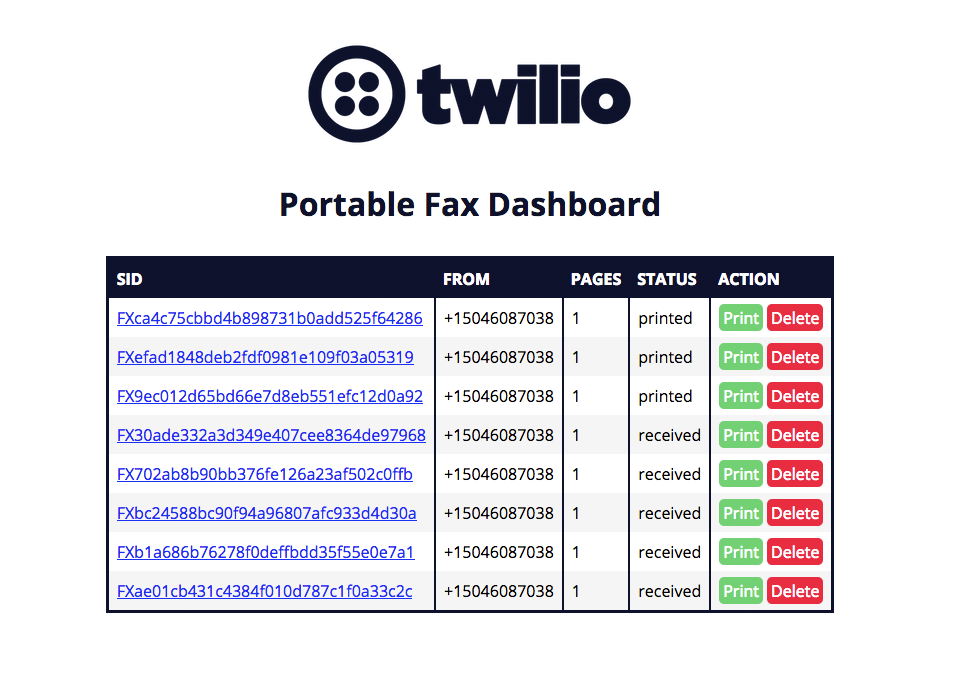

# Portable Fax Machine
This repository demonstrates how to create a portable fax machine using a Raspberry Pi and Programmable Fax.

[Learn more by reading the blog post on blog.twilio.com.](https://www.twilio.com/blog/2018/05/build-a-cellular-connected-raspberry-pi-fax-machine.html)

#### Printer

#### Dashboard

Dashboard built with [Vue.js](https://vuejs.org/).

#### Hardware requirements
* [Portable fax machine shopping list](http://a.co/1yhQJWX)
* [Programmable Wireless SIM card](https://www.twilio.com/console/wireless/orders/new)

You can replace your USB modem with a 4G LTE shield:
* Cellular connectivity
	* [Raspberry Pi 3G-4G/LTE Base Shield](http://sixfab.com/product/raspberry-pi-3g-4glte-base-shield-v2/)
	* [Quectel 4G/LTE module](http://sixfab.com/product/quectel-ec25-mini-pcle-4glte-module/) **or** [Quectel 3G module](http://sixfab.com/product/quectel-uc20-mini-pcle-3g-module/)

> Set up your Raspberry Pi and LTE USB modem by following the [headless Raspberry Pi quickstart](https://www.twilio.com/docs/wireless/quickstart/raspberry-pi-headless-usb-modem).

#### Additional requirements
* [Twilio account](https://www.twilio.com/try-twilio)

#### Software and services
* Server/Client
	* [Node.JS](https://nodejs.org/en/)
* Services
	* [Programmable Fax](https://www.twilio.com/fax)
	* [Programmable Wireless](https://www.twilio.com/wireless)
	* [Sync](https://www.twilio.com/sync)

#### Hardware guides
Follow along with these guides to
1. [Set up the Raspbian operating system](http://thisdavej.com/beginners-guide-to-installing-node-js-on-a-raspberry-pi/)
2. [Set up the thermal printer](https://learn.adafruit.com/networked-thermal-printer-using-cups-and-raspberry-pi/overview)
3. [Set up the SixFab 3G/4G modem](http://sixfab.com/updated-tutorial-3-make-a-ppp-internet-connection-with-3g-4glte-shields-on-raspberry-pi/)

#### Software guides
Follow along in each folder in this repository to
1. [Set up your Twilio services](/runtime)
2. [Set up your server](/server)
3. [Set up your client](/pi)
